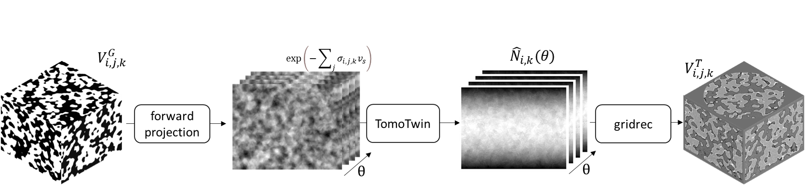

========
TomoTwin
========

**TomoTwin** is a simple digital twin for synchrotron tomography that provides an API to generate realistic grayscale tomography datasets from ground-truth (labeled) volumes as training data for denoising and segmentation models. The grayscale data mimics imaging artifacts such as noise and in-line phase contrast with a dependence on the instrument parameters such as detector configuration and beam energy.

Contribute
----------

* Documentation: https://github.com/aniketkt/TomoTwin/tree/master/doc
* Issue Tracker: https://github.com/aniketkt/TomoTwin/docs/issues
* Source Code: https://github.com/aniketkt/TomoTwin/

Content
-------

.. toctree::
   :maxdepth: 1

   source/about
   source/install
   source/usage
   source/api
   source/credits
