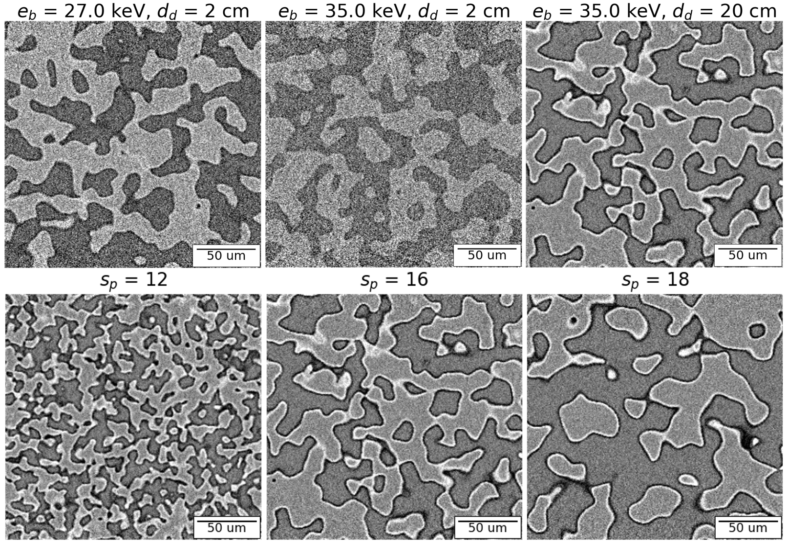

=====
About
=====

Description
=============

ray module
-----------------

Two classes are implemented: The 'Phantom' class is instantiated by passing a ground-truth labeled volume and the material name and density corresponding to each label. For example, in a porous volume mimicing rock, the voxels belonging to the matrix could be labeled '1' and those belonging to the pores could be labeled '0'. The material names and corresponding density (g/cc) would be passed as a dictionary {"air" : 0.00122, "silica" : 2.7} in that order. The 'Material' class is instantiated for each material by reading the attenuation data from model_data/materials folder. You may use XOP to generate new materials by following the README file in model_data/. Further details are in our paper.

.. image:: img/schematic.png
   :width: 320px
   :alt: project

gt_generators module
--------------------

You may pass your own labeled volumes to the Phantom class. This file provides functions to parametrically create some labeled volumes that mimic porous materials, inclusions, etc. You could create a volume of up to 256 labels as this will be handled as 8-bit data.  

jupyter notebooks
-----------------
A few example images are shown above. ${s_p}$ is a size parameter for the phantom while the acquisition parameters (beam energy and detector distance) affect the contrast in the grayscale images. For tutorials on how to use TomoTwin, please check out the jupyter notebooks that are provided with the installation. You can run them by clicking on the binder button at the top of the README.

Tell me more
------------

Our paper is under review for IEEE-ICIP 2021 and will be up on arXiv very soon!
